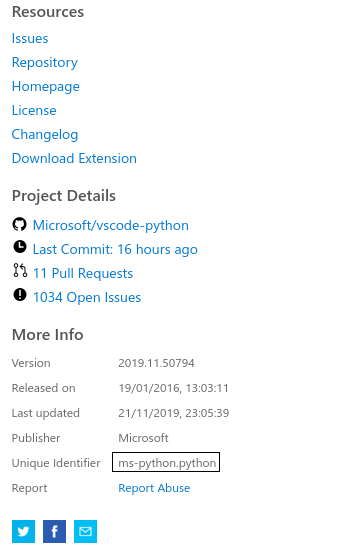

# MLQS

## Quick Overview

**M**anjaro **L**ive **Q**uick **S**etup is a little shell package for automatizing my installation routine for Manjaro Live Linux. I don't think this will be useful for you, but you can play around with it and customize your own routines for live systems. I intent to expand the list of compatible Linux ditros (actually, this was developed for Arch Based Linux Distros, which uses Pacman for Package Managing).
It's important to say that this shell script file is very, very "just do it", without any error handler, connection check or anything like that, **but**, feel free to contribute (and maybe expand) this little project of mine.

## What's inside?

Well, nothing very complicated if you know how to read shell scripts. But if you don't, i'll explain it to you.

#### The Code:

```sh
#!/bin/bash

# Author: Bryan Souza (hellstrike12)

# [1]------------------------------------------------------
function spinner() {
    local info="$1"
    local pid=$!
    local delay=0.75
    local spinstr='|/-\'
    while kill -0 $pid 2> /dev/null; do
        local temp=${spinstr#?}
        printf " [%c]  $info" "$spinstr"
        local spinstr=$temp${spinstr%"$temp"}
        sleep $delay
        local reset="\b\b\b\b\b\b"
        for ((i=1; i<=$(echo $info | wc -c); i++)); do
            reset+="\b"
        done
        printf $reset
    done
    printf "    \b\b\b\b"
}
#----------------------------------------------------------

# [2]-------------------------------------------------------
sudo pacman-mirrors --country Brazil &> /dev/null &&
sudo pacman -Syyu code nodejs npm --noconfirm &> /dev/null &
spinner "Instalando VS Code, NodeJS, NPM e ShellCheck..."
echo ' [OK] Instalando VS Code, NodeJS, NPM e ShellCheck...'
#-----------------------------------------------------------

# [3]-----------------------------------------------------------------------
code --install-extension ms-python.python &> /dev/null &&
code --install-extension dbaeumer.vscode-eslint &> /dev/null &&
code --install-extension eamodio.gitlens &> /dev/null &&
code --install-extension christian-kohler.path-intellisense &> /dev/null &&
code --install-extension CoenraadS.bracket-pair-colorizer &> /dev/null &&
code --install-extension ritwickdey.LiveServer &> /dev/null &&
code --install-extension esbenp.prettier-vscode &> /dev/null &&
code --install-extension vscode-icons-team.vscode-icons &> /dev/null &&
code --install-extension akamud.vscode-theme-onedark &> /dev/null &&
code --install-extension shd101wyy.markdown-preview-enhanced &> /dev/null &&
code --install-extension truman.autocomplate-shell &> /dev/null &&
code --install-extension timonwong.shellcheck &> /dev/null &
spinner "Instalando extensões do VS Code..."
echo ' [OK] Instalando extensões do VS Code...'
#---------------------------------------------------------------------------

# [4]-------------------------------------------------
cp -f settings.json $HOME/.config/Code\ -\ OSS/User/ &
spinner "Atualizando configurações..."
echo ' [OK] Atualizando configurações...'
#-----------------------------------------------------

# [5]------------------------------------------------------
python -m pip install --user pylint autopep8 &> /dev/null &
spinner "Instalando módulos do python..."
echo ' [OK] Instalando módulos do python...'
#----------------------------------------------------------

# [6]-----------------------------------------
sudo npm install -g eslint vsce &> /dev/null &
spinner "Instalando ESLint e VSCE..."
echo ' [OK] Instalando ESLint e VSCE...'
#---------------------------------------------

# [7]-----------------------------------------------------
git config --global user.name "hellstrike12" &
git config --global user.email "hellstrike12@github.com" &
git config --global color.ui auto &
spinner "Configurando Git e GitHub..."
echo ' [OK] Configurando Git e GitHub...'
#---------------------------------------------------------

# [8]-------------------------------------------------------------------
cd $HOME &&
git clone https://github.com/hellstrike12/python-game.git &> /dev/null &
spinner "Clonando repositório do GitHub [python-game]..."
echo ' [OK] Clonando repositório do GitHub [python-game]...'
#-----------------------------------------------------------------------

# [9]---------------------
echo "      Hora do Show!"
cd $HOME/python-game
code .
exit
#-------------------------
```

#### The Explanation

##### 1st Block

```sh
function spinner() {
    local info="$1"
    local pid=$!
    local delay=0.75
    local spinstr='|/-\'
    while kill -0 $pid 2> /dev/null; do
        local temp=${spinstr#?}
        printf " [%c]  $info" "$spinstr"
        local spinstr=$temp${spinstr%"$temp"}
        sleep $delay
        local reset="\b\b\b\b\b\b"
        for ((i=1; i<=$(echo $info | wc -c); i++)); do
            reset+="\b"
        done
        printf $reset
    done
    printf "    \b\b\b\b"
}
```

This code is kinda optional, it just adds a spinning wheel for checking if the script stills running or not. Also, it adds some charm to the script itself, making it more human understandable.

##### 2nd Block

```sh
sudo pacman-mirrors --country Brazil &> /dev/null &&
sudo pacman -Syyu code nodejs npm shellcheck --noconfirm &> /dev/null &
spinner "Instalando VS Code, NodeJS, NPM e ShellCheck..."
echo ' [OK] Instalando VS Code, NodeJS, NPM e ShellCheck...'
```

The 1st line is for updating pacman mirror list to use only my country servers. Honestly, only use this if your internet connection is poor and/or slow, otherwise, comment this line by putting a `#` symbol before `sudo`.
The 2nd line is for upgrading all user applications and pacman DB (`sudo pacman -Syu`)(only add the other 'y' if you kept the first line uncommented, it's used to force pacman to update its database), and automatically install (`--noconfirm`) Visual Studio Code, NodeJS, NPM and ShellCheck.
_Note: I used_ `&> /dev/null` _for omitting the commands' output (including stderr)_
Finally, the last two lines is for printing an message in the console, followed by our spinner animation. The last `echo` is for printing the command message with an OK in it, indicating the command conclusion

##### 3rd Block

```sh
code --install-extension ms-python.python &> /dev/null &&
code --install-extension dbaeumer.vscode-eslint &> /dev/null &&
code --install-extension eamodio.gitlens &> /dev/null &&
code --install-extension christian-kohler.path-intellisense &> /dev/null &&
code --install-extension CoenraadS.bracket-pair-colorizer &> /dev/null &&
code --install-extension ritwickdey.LiveServer &> /dev/null &&
code --install-extension esbenp.prettier-vscode &> /dev/null &&
code --install-extension vscode-icons-team.vscode-icons &> /dev/null &&
code --install-extension akamud.vscode-theme-onedark &> /dev/null &&
code --install-extension shd101wyy.markdown-preview-enhanced &> /dev/null &&
code --install-extension truman.autocomplate-shell &> /dev/null &&
code --install-extension timonwong.shellcheck &> /dev/null &
spinner "Instalando extensões do VS Code..."
echo ' [OK] Instalando extensões do VS Code...'
```

This code block is very simple: it uses the shell for downloading and installing Visual Studio Code Extensions (.VSIX). You can use the following code snippet for installing your custom extensions:

```sh
code --install-extension [publisher-name].[package-name]
```

These informations can be found in the [Visual Studio Marketplace](https://marketplace.visualstudio.com/vscode), by the name of "Unique Identifier", like this (using the Python Extension for example):
</br>

<center>



</center>
</br>

##### 4th Block

```sh
cp -f settings.json $HOME/.config/Code\ -\ OSS/User/ &
spinner "Atualizando configurações..."
echo ' [OK] Atualizando configurações...'
```

Overwrites the VS Code settings.json, applying my modified one, with custom theme and icon pack applied. If you want to overwrite with your own custom settings.json file, just put it inside this folder and the script will take care of the rest

##### 5th Block

```sh
python -m pip install --user pylint autopep8 &> /dev/null &
spinner "Instalando módulos do python..."
echo ' [OK] Instalando módulos do python...'
```

Installs python modules with pip, which are dependencies for the VS Code Python Extension (pylint is for pyhton linting and autopep8 is for python automatic formatting). Use the following code snippet for installing python modules:

```sh
python -m pip install --user [package-name]
```

_Note: The_ `--user` _option is for installing the python modules **only** for the currently logged user, omit it for installing it globally_

##### 6th Block

```sh
sudo npm install -g eslint vsce &> /dev/null &
spinner "Instalando ESLint e VSCE..."
echo ' [OK] Instalando ESLint e VSCE...'
```

Installs NPM modules, which are required by ESLint and AutoComplate-Shell. Use the following code snippet for installing NPM packages:

```sh
sudo npm install -g [package-name]
```

_Note: the_ `-g` _option installs packages globally, alternatively, you can install NPM packages locally (repo-specific) by initializing an NPM package inside your repo and installing inside it. Just type:_

```sh
sudo npm init
sudo npm install [package-name] --save
```

##### 7th Block

```sh
git config --global user.name "hellstrike12" &&
git config --global user.email "hellstrike12@github.com" &&
git config --global color.ui auto &
spinner "Configurando Git e GitHub..."
echo ' [OK] Configurando Git e GitHub...'
```

This code block is used for applying git configurations globally, setting standard username, email and color options. This is necessary for using GitLens and Git code snippets like pull, push, fetch, etc.
Code snippets:

```sh
git config --global user.name "[your-github-username]" &&
git config --global user.email "[your-github-username]@github.com" &&
git config --global color.ui auto
```

##### 8th Block

```sh
git clone https://github.com/hellstrike12/python-game.git &> /dev/null &
spinner "Clonando repositório do GitHub [python-game]..."
echo ' [OK] Clonando repositório do GitHub [python-game]...'
```

This clones from an github repository.
Code Snippet:

```sh
git clone https://github.com/[author]/[repository].git
```

##### 9th Block

```sh
echo "      Hora do Show!"
cd $HOME/python-game
code .
exit
```

This code block can be omitted, but it's function is: change to the cloned repository and start VS Code
Code Snippet:

```sh
cd [path-to-repository]
code .
```
